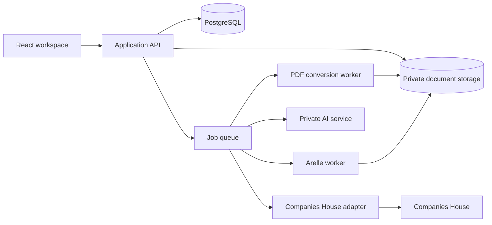

> Fixture decision, 28 September 2026: the user selected Grant Thornton's FY26
> FRS 102 illustrative accounts as the principal local proof-of-concept report.
> The original PDF and all derived content remain local. The existing synthetic
> report remains a focused regression fixture; representative synthetic accounts
> for the public project will follow. This supersedes the principal-fixture
> choice below without changing the application scope or release gates.

# Tagger: PDF-to-iXBRL application and Companies House filing

## 1. Product outcome and agreed scope

Build an open-source, self-hostable web application that lets a private team:

1. Create a filing project and choose the applicable taxonomy and filing profile.
2. Upload a PDF and obtain a faithful, selectable HTML rendition.
3. Review conversion quality and repair errors.
4. Freely tag report content using Cake’s taxonomy explorer.
5. Set and inspect concepts, periods, units, dimensions, precision and transformations.
6. Run technical, filing and business-rule validation.
7. Use a local generative assistant for suggestions and explanations.
8. Review and approve the exact generated iXBRL.
9. Download it, test the submission workflow, and submit authorised production filings.
10. Preserve the evidence, decisions, revisions and filing receipts.

**The first complete release covers general accounts for UK companies and LLPs**, across FRS 101, FRS 102/105 and UK-adopted IFRS, wherever the particular entity, accounts category and filing route are eligible. Audited, unaudited, dormant and applicable small/micro-entity cases belong in the filing-profile matrix.

The delivery sequence will use an FRS 102 report first to prove the architecture, but the release is not complete until the agreed company and LLP profiles pass their acceptance tests.

Agreed boundaries:

- Start with PDFs containing selectable text. Detect scanned or untaggable pages; local OCR follows the first release.
- Support conversion repair, not full accounts authoring.
- Support individual accounts, project permissions, reviewers and filers; allow explicitly recorded self-approval.
- Allow one active editor per report, with concurrent viewing and reviewing.
- Include reviewed carry-forward to revised PDFs and subsequent reporting years.
- Include editable business rules and local generative assistance before production filing.
- Defer specialist package journeys—such as UKSEF, Welsh packages and subsidiary exemption packages—to later profile releases.
- Keep unpublished reports within the controlled deployment, except for explicitly authorised Companies House validation or submission.

### Cake preservation commitment

Cake is the foundation for the taxonomy experience. Preserve:

- Tree nesting, ordering, expansion and navigation.
- Existing concept-type icons and their meanings.
- Colour distinctions, selection and highlighting.
- Presentation and definition-network views.
- Search, filtering, navigation to occurrences and concept details.
- Labels, references, dimensions, members and hypercube exploration.
- Existing contextual help, deep links and filtered-tree exports.

Capture these as a feature checklist and visual regression baseline against `cake/vps` commit `9251b790faa65b78d80dbe4528fcdd3aefef1238`.

The inspected implementation centralises icon and colour choices in `frontend/src/components/taxonomy/explorer/tree_utils.ts`, lines 60–169, and renders them in `TaxonomyTreeView.tsx`, approximately lines 190–255. Extract those behaviours behind stable interfaces rather than redesigning them during migration.

Charles supplies micro-entity regression examples and workflow ideas. Soft supplies rule-management and validation-presentation ideas. Neither supplies the new core domain model.

## 2. Architecture and contracts

### Technology choices

| Area | Planned choice |
|---|---|
| Browser application | React, TypeScript and Vite |
| Taxonomy tree | Retain Cake’s PrimeReact tree initially, behind an application component interface |
| UI styling | Shared components and semantic design tokens; preserve Cake’s visual vocabulary |
| Application API | Python, Django and Django REST Framework |
| Primary database | PostgreSQL |
| Background jobs | Celery with RabbitMQ; durable job records in PostgreSQL |
| Document storage | Private filesystem storage on encrypted volumes, behind a blob-storage interface |
| XBRL processing | Arelle in isolated worker processes, behind an application adapter |
| PDF conversion | Pinned pdf2htmlEX build in a restricted conversion worker |
| Local AI | Private llama.cpp service; CPU initially, optional GPU deployment |
| Deployment | Linux and Docker Compose, with TLS at a reverse proxy |
| Automated verification | Python tests, TypeScript tests, Playwright and accessibility checks |

Django provides a coherent starting point for accounts, sessions, permissions and migrations. Cake’s reusable taxonomy services and frontend components will be extracted; its Flask application and shared active-taxonomy state will not become the new application’s foundation.

Use a **modular application with isolated processing workers**. Avoid splitting ordinary business operations into numerous independently deployed services.

The PDF, XBRL and AI workers have no general outbound network access during report processing. Taxonomies, models and dependencies are acquired through separate administrative maintenance procedures.

### Domain model

The backend owns domain invariants. Browser types are generated from versioned API contracts.

| Record | Required responsibility |
|---|---|
| Project | Entity, reporting periods, filing profile, permissions and current revision |
| Source document | Immutable original PDF, checksum and import metadata |
| Document revision | Normalised XHTML, assets, text structure and recorded repairs |
| Source anchor | Stable node identifiers, text ranges, page coordinates and identifying text |
| Fact | Expanded concept QName, value, source anchors, context, unit and tagging properties |
| Context | Entity identifier and scheme, period, explicit/typed dimensions and their placement |
| Unit | Canonical simple or compound measures |
| Taxonomy selection | Package checksum, version, entry point and dependency manifest |
| Rule pack | Versioned rules, applicability, evidence and review status |
| Validation run | Exact inputs, processor/rule versions, findings and completion status |
| Export | Immutable generated bytes, checksum and associated validation evidence |
| Approval/submission | Actor, approved export, authority, destination, lifecycle and receipts |
| Audit event | Actor, operation, affected records and revision references |

Important invariants:

- Use decimal arithmetic for financial values; transport decimals as strings.
- Identify concepts by namespace URI and local name, not a preferred prefix.
- Keep displayed text, transformed fact value, scale and decimals distinct.
- Represent typed dimensions explicitly; do not reduce them to arbitrary member strings.
- Keep tags separate from rendered HTML until generation.
- Treat zero, false, nil and absent values as different states.
- Never silently move a tag after its source changes.
- Never mutate an approved export or submitted payload.

### Application interfaces

Provide versioned `/api/v1` resources for projects, documents, taxonomy queries, facts, rules, validation, exports, approvals and submissions.

Use explicit commands for report changes. Each command carries an expected revision and a client-generated operation identifier. Reject stale revisions and safely deduplicate repeated requests.

Long-running operations return a job identifier with progress, cancellation and a durable result. Broker messages contain identifiers, rather than report contents.

Define replaceable interfaces for:

- `DocumentConverter`
- `TaxonomyProvider`
- `XbrlProcessor`
- `RuleEvaluator`
- `AssistanceProvider`
- `BlobStore`
- `FilingGateway`

No React component should import processor-specific objects or implement filing rules. Changing layout, themes or component libraries must leave these interfaces and domain tests intact.

## 3. Required behaviour

### PDF conversion and repair

Use pdf2htmlEX as the first engine to qualify. It is designed to preserve text positioning and fonts, but appearance alone does not establish correct extractable text. Its upstream documentation also identifies rendering edge cases. [pdf2htmlEX](https://github.com/pdf2htmlex/pdf2htmlex)

Maintain three linked representations:

1. The immutable source PDF.
2. A faithful XHTML rendition for visual tagging and export.
3. A logical text/block/table model for selection, navigation, accessibility and source anchoring.

Do not require an automatic reflow of the whole report before tagging. Preserve page layout while adding the structure needed for dependable interaction.

The pipeline must:

- Inspect encryption, page count, text availability and resource limits.
- Run conversion in an isolated process with bounded memory and execution time.
- Remove executable content and uncontrolled external resources.
- Produce well-formed XHTML with stable identifiers.
- Record converter version, configuration, asset hashes and diagnostic findings.
- Detect missing glyphs, suspicious character mappings, fragmented numbers and unreadable text.
- Support side-by-side PDF/rendition comparison.
- Permit corrections to text, reading order, block boundaries and table structure.
- Create a new revision for every accepted repair.

Provide an advanced conversion-settings panel for font handling, Unicode mapping and rendering options. Re-conversion creates a candidate document revision and requires tag reconciliation.

The AMANA documentation explicitly describes the trade-off between correct visual rendering and correct copied characters when handling Unicode maps. This becomes a conversion acceptance test. [AMANA settings](https://amana.atlassian.net/wiki/spaces/XBRLD/pages/32211825/Tagger+Settings)

### Tagging workspace

Use three resizable areas:

- **Taxonomy explorer:** Cake’s tree, search and concept information.
- **Report canvas:** PDF-derived pages, selections and tagging overlays.
- **Inspector:** fact properties, dimensions, validation and provenance.

Provide a collapsible findings panel and a keyboard-accessible command menu.

The tagging interaction is:

1. Select report text, a number, a cell or a block.
2. Drag a concept onto the selection, or select the concept and activate **Apply tag**.
3. Preview the resulting fact, including inherited defaults.
4. Resolve required context, unit or dimension information.
5. Save the tagging command.

Dropping onto unselected content should propose a word, number, cell or block boundary for confirmation. It must not silently guess an ambiguous range.

Support:

- Narrative and numeric facts.
- Multi-line and multi-page text selections.
- Continuations, footnotes and permitted nested tagging.
- Repeated values in different contexts.
- Explicit and typed dimensions.
- Table tagging with reviewed row/column defaults and bulk application.
- Undo/redo and visible autosave status.
- Navigation between facts, source locations and validation findings.
- Tagged/untagged overlays, without claiming every untagged word is an omission.

Equivalent keyboard and click-only tagging paths are mandatory. Keyboard support alone does not satisfy the WCAG requirement for a non-dragging pointer alternative. [WCAG 2.2](https://www.w3.org/TR/WCAG22/)

### Appearance and accessibility

Provide per-user settings for:

- Light, dark and system theme.
- Interface font size and density.
- Report zoom.
- Panel arrangement and widths.
- Reduced motion.
- Tag-overlay visibility.
- Taxonomy label language where available.

Keep workspace preferences separate from document/export styling. Night mode must not unexpectedly recolour a filing, and increasing interface text must not alter account values or line breaks in the exported document.

Preserve Cake’s icon meanings across themes. Adjust contrast using design tokens and provide labels or shapes so meaning does not depend on colour alone.

Target WCAG 2.2 AA for application workflows. Supply a logical reading/selection view for content that cannot be operated accessibly in its fixed page layout.

### Validation and generation

Implement separate validation layers:

1. Import and source-anchor integrity.
2. Fact datatype, period, unit, transformation, sign, scale and decimals.
3. XBRL and dimensional validity through Arelle.
4. Applicable calculation checks.
5. Companies House profile requirements.
6. Organisation-authored business rules.
7. Advisory disclosure coverage and tagging-quality findings.
8. Final generated-document validation and visual review.

Each finding must identify its source, severity, rule/version, affected facts, source location and explanation.

Distinguish **valid**, **invalid**, **not checked** and **unable to complete**. A processor failure or missing taxonomy must never appear as a successful validation.

Generate from an immutable project revision, using pinned taxonomy, rules and processor versions. Serialise deterministically: the same revision and generation configuration should produce identical iXBRL bytes. Store operational timestamps separately where they would otherwise undermine reproducibility.

Generation must handle namespace declarations, resources, contexts, units, transformations, continuations, exclusions, nil values and footnotes. Resolve overlapping annotations into legal iXBRL or return a precise blocking finding.

Reparse generated output and compare its facts with the intended fact model. Do not use Charles’s fixture-signature comparison as the general correctness test.

### Rules, coverage and local assistance

Use a bounded declarative rule language supporting fact selection, existence, comparisons, arithmetic, aggregation, period relationships and dimensional conditions. Do not allow arbitrary Python, JavaScript or SQL.

Provide draft, test, publish, archive and restore workflows. Published versions are immutable. Runs record the exact rule pack used.

Official filing rules and user-authored advisory rules remain distinguishable. Users can acknowledge advisory findings with reasons; acknowledging a finding does not override a technical or filing rejection.

Coverage analysis must explain what it checked and what evidence it found. It must not label an account set “fully compliant” merely because expected concepts are present.

For the generative assistant:

- Use a private llama.cpp endpoint.
- Start qualification with Qwen3-8B GGUF, `Q4_K_M`, on the 32 GB development machine.
- Use bounded context, one inference job initially, and a non-thinking response mode for ordinary suggestions.
- Retrieve relevant taxonomy concepts, labels, references and approved guidance before generation.
- Restrict suggestions to valid candidate identifiers.
- Validate proposed tag/rule changes through normal application services.
- Require human acceptance of changes.
- Record model/configuration versions, evidence and accepted decisions.
- Treat report text and retrieved material as untrusted input; the model cannot submit filings or execute arbitrary tools.

The initial model is a benchmark starting point, not a promise of adequate accounting expertise. Its official model card documents the GGUF variant and local llama.cpp support. [Qwen model card](https://huggingface.co/Qwen/Qwen3-8B-GGUF)

Moving inference to a GPU host changes deployment configuration, not report data or application interfaces. Manual tagging and validation continue to work when inference is unavailable.

### Review, carry-forward and filing

Use this report lifecycle:

**Draft → Ready for review → Approved export → Submission pending → Accepted/rejected**

Keep transport uncertainty as an explicit submission state.

Any change affecting report contents, tags or generation configuration requires a new export and approval. An authorised person may self-approve, but approval and filing remain separate recorded actions.

Carry-forward creates a new project revision. Match anchors using structure, text and location; present exact, changed, ambiguous and unmatched cases. Never automatically accept a changed amount, period or taxonomy mapping.

For filing:

- Keep test and production credentials and destinations distinct.
- Validate the GovTalk envelope against pinned schemas.
- Allocate unique submission identifiers and persist the submission intent before transmission.
- Preserve exact payload hashes and restricted evidence copies.
- Poll for status and distinguish gateway acknowledgement from acceptance.
- Reconcile uncertain outcomes before considering retransmission.
- Prevent double-clicks, worker retries and restarts from creating duplicate filings.
- Support rejection correction as a new approved export and submission attempt.

The current Companies House guidance requires test credentials, unique envelope numbers and status polling; some test submissions require manual Companies House review. Test-validator success alone is not completion of this process. [Companies House developer guidance](https://www.gov.uk/government/publications/technical-interface-specifications-for-companies-house-software/important-information-for-software-developers-read-first)

## 4. Delivery sequence and completion gates

Work through these milestones in order. Each produces a demonstrable result and acceptance evidence before the next dependent milestone starts.

| Step | Work | Completion gate |
|---|---|---|
| **1. Baseline and qualification** | Record the intake findings; protect local materials from publication; create the company/LLP filing-profile matrix; pin regulatory sources; inventory licences; qualify conversion and Arelle validation tooling. | Candidate profiles have source references and positive/negative case specifications. Feasibility evidence, redistribution obligations and external dependencies are documented. Full qualification is explicitly assigned to its owning milestones in [the foundation decision](decisions/0001-foundation-boundary.md); no profile is thereby qualified. |
| **2. Application foundation** | Establish the modular repository, CI, API contracts, database migrations, accounts, project permissions, private storage and durable jobs. | A user can create and reopen a private project; another unauthorised user cannot access its data; migrations and restore procedures work. |
| **3. Domain and revisions** | Implement documents, anchors, facts, contexts, units, command processing, revisions and audit records. | Domain tests cover exact numeric values, dimensions, undo, stale edits and operation deduplication. Revision snapshots reproduce their state. |
| **4. Cake integration** | Extract the explorer and visual mappings; implement package/entry-point queries and replace global active-taxonomy state. | The Cake parity checklist passes. Two projects using different taxonomies cannot contaminate each other’s results. Complete packages load without runtime internet access. |
| **5. PDF conversion** | Implement upload, pdf2htmlEX processing, XHTML normalisation, diagnostics, comparison and repair. | The conversion corpus has no unexplained missing or changed financial text. Selected text agrees with the visible rendition. Repairs preserve traceability. |
| **6. Manual free tagging** | Implement selection, drag/drop, click and keyboard application, fact inspection, dimensions, bulk table tagging and undo. | A substantial report can be tagged end to end through each interaction method. All tag edits survive reload and retain valid anchors. |
| **7. Validation** | Integrate structured Arelle results, datatype/context checks and versioned Companies House rules. | Deliberately invalid fixtures fail for the expected reasons; unavailable checks are shown honestly; findings navigate to the relevant content. |
| **8. Deterministic export** | Generate complete iXBRL, validate the output, compare extracted facts and build export evidence manifests. | Repeat generation is byte-stable; intended and extracted facts match; qualified fixtures pass applicable conformance checks. |
| **9. Review and approval** | Add comments, issue resolution, visual/fact review, export approval and permission checks. | Approval identifies exact bytes; changes invalidate eligibility for filing; explicit self-approval is auditable. |
| **10. Rules and coverage** | Adapt Soft’s useful workflow ideas into the declarative rule engine, editor, tests and published packs. | Rules execute reproducibly; invalid or unbounded rules are rejected; advisory coverage results remain separate from filing validity. |
| **11. Local generative assistance** | Add retrieval, chat, tag/rule proposals, evidence presentation, acceptance and provenance. | The evaluation corpus meets the agreed quality threshold; fabricated concept identifiers are rejected; prompts cannot initiate actions; report processing produces no external inference traffic. |
| **12. Reuse across reports** | Add revised-PDF reconciliation, annual carry-forward and versioned starter templates using the same domain model. | Changed and ambiguous matches require review; old projects remain reproducible; taxonomy changes trigger fresh validation. |
| **13. Companies House test filing** | Implement envelope generation, credential handling, submission, polling, receipts and reconciliation. | Positive/negative profile tests and restart/timeout scenarios pass. Required Companies House testing has been completed. |
| **14. Release assurance** | Complete accessibility, security, performance, backup/restore and deployment reviews; produce administrator and user guidance. | Release gates below pass and independent findings are resolved or explicitly accepted where appropriate. |
| **15. Controlled production filing** | Enable production for authorised filers and qualified profiles; submit an explicitly authorised real filing and reconcile its final outcome. | Approved bytes reach the intended destination once; final acceptance/rejection and the evidence trail are retained. |

Start the Companies House test-account application during Step 1 because it is an external dependency. The application does not need to wait for account issuance to complete its local development milestones.

### Fixtures

Create one substantial synthetic FRS 102 report as the principal fixture, with:

- Narrative disclosures and financial tables.
- Comparative periods and multiple units.
- Scaling, signs, decimals and zero/nil distinctions.
- Explicit and typed dimensions.
- Continuations, footnotes and repeated disclosures.
- Deliberate conversion, tagging and validation errors.

Add focused companion fixtures for FRS 101, IFRS, LLP and micro-entity cases. Use Charles’s behaviour as a regression reference after removing or replacing any unverified real-world content.

Include different PDF producers, embedded/subset fonts, ligatures, rotated text and fragmented numeric runs in the conversion corpus.

## 5. Verification, operations and release criteria

### Tests required throughout development

| Area | Essential scenarios |
|---|---|
| Conversion | Wrong/missing Unicode maps, font substitution, invisible text, split numbers, multi-column reading order and partial scans |
| Anchors | Repeated text, edits before a selection, deleted content, page changes and ambiguous carry-forward |
| Facts | Negative values, scale/decimals distinction, nil/zero/false, dates, compound units and duplicate facts |
| Dimensions | Defaults, typed values, inherited relationships, target roles, closed cubes and prohibited combinations |
| Generation | Escaping, namespaces, nested facts, continuations, exclusions, footnotes and deterministic output |
| Taxonomies | Different entry points, offline dependencies, corrupt packages and explicit version migration |
| Team access | Project isolation, expired editing leases, stale commands and approval permissions |
| Filing | Duplicate clicks, lost responses, worker crashes, pending status, rejection and retry reconciliation |
| AI | Unsupported concepts, misleading explanations, prompt injection, unavailable models and human rejection |
| Accessibility | Complete keyboard and click-only workflows, focus recovery, zoom, contrast and screen-reader navigation |

Use Arelle plus the applicable XBRL conformance suites. Arelle validation, conformance testing, generated-fact comparison and Companies House testing remain required. Independent processor comparison is an optional, vendor-neutral assurance activity; no second processor or licence is a development, export or release prerequisite.

Successful Companies House tests and any optional second-processor comparison provide evidence; they do not automatically certify this application.

### Security and operational defaults

- Private deployment, individual logins and project-level access checks.
- Secure session cookies, CSRF protection and MFA for administrators and production filers.
- Encryption for storage volumes, backups and transport.
- Server-side storage of filing credentials with separate encryption keys.
- Sandboxed document rendering and isolated conversion/validation processes.
- No public CDN dependencies or report-content analytics.
- Redacted operational logs; sensitive audit evidence stays inside project storage.
- Daily encrypted backups, with a tested restore procedure before production.
- Retain projects until explicit administrative deletion; document backup expiry and deletion behaviour.
- Monitor failed jobs, queue backlog, storage capacity, validation failures and unresolved submissions.

Initial performance qualification will use a **32 GB Linux host**, five active users, and reports up to **300 pages / 20,000 facts**. These are engineering test targets, not measured capability claims.

Target responsive selection and overlays, taxonomy search below 500 ms at the 95th percentile after indexing, and clearly visible autosave completion. Long operations remain asynchronous, bounded and cancellable. CPU inference has separate resource limits so it cannot stall editing or filing-status processing.

### Open-source and maintenance defaults

Use **GPL-3.0-or-later** as the planned application licence, with third-party notices and corresponding-source obligations reviewed before distribution. pdf2htmlEX itself declares GPLv3-or-later and separate terms for some resources. [pdf2htmlEX licence](https://raw.githubusercontent.com/pdf2htmlEX/pdf2htmlEX/master/LICENSE)

Keep client reports, bundles, databases, credentials and model weights out of the public repository. Publish code, permitted synthetic fixtures, specifications and derived documentation with appropriate attribution.

Pin dependency versions, container digests, taxonomy packages, model files and rule packs. Updates run through the same regression and qualification process; they never silently replace the dependencies of an existing project revision.

For each milestone, maintain:

- A small implementation backlog tied to requirements.
- Acceptance tests and a demonstration script.
- Design decisions and known limitations.
- Migration/rollback notes where state changes.
- A completion record containing the actual verification evidence.

The first implementation milestone is **baseline and qualification**, followed by the foundation and Cake extraction. Production filing is enabled only after the complete PDF-to-approved-export workflow, supported profile matrix and submission recovery behaviour have passed their gates.
